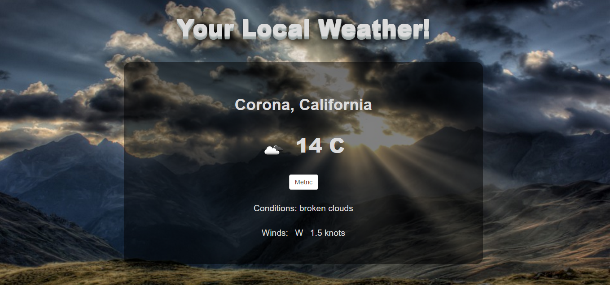
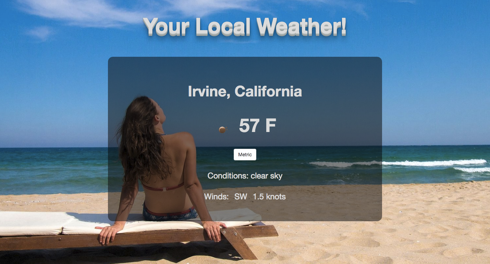

# Local Weather App

**About the Project**

The Show Local Weather App is one of the intermediate challenges found on FreeCodeCamp.com.  It was a great project for utilizing APIs and handling the data that they return.

**Features**

* Generate weather data based on latitude and longitude coordinates.
* APIs used include Open Weather API, and ipinfo.io.
* Different Icons and Background images depending on local weather.
* Functions for converting kelvins into fahrenheit and celsius on click.
* Object Oriented JS

**What I learned**

For this project I learned how to use the two API mentioned above, as well as a reminder that technology is always changing.  Initially I used the HTML5 geolocation spec, however soon found that it had been removed from chrome on unsecured http requests.  Therefore I researched other options and was able to find that I could also obtain the needed coords with the user's IP address.

